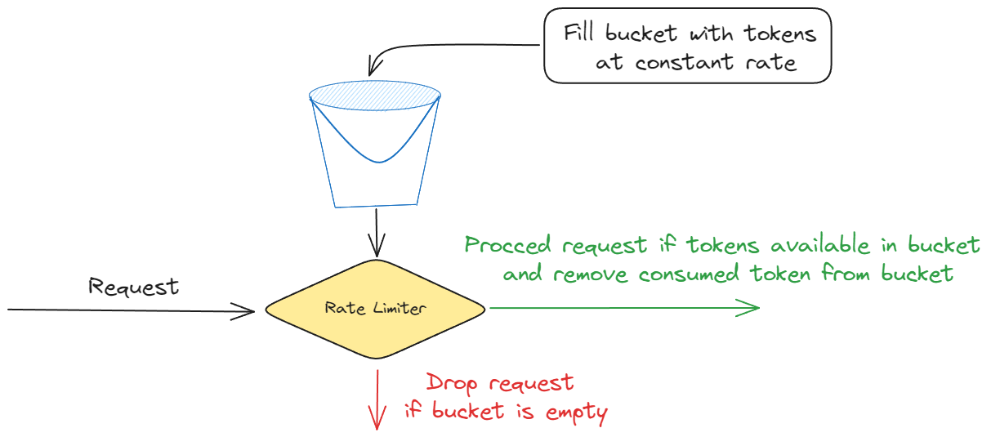
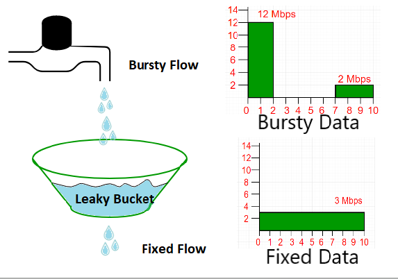

# Rate Limiter in Go

A simple and extensible rate limiting library in Go, implementing **Token Bucket** and **Leaky Bucket** algorithms. This project includes:

- Modular rate limiter implementations following SOLID principles
- A configurable simulation harness to test limiter behavior under load
- Runtime configuration via YAML or environment variables
- CLI flag support for quick runtime overrides

---

<table>
    <tr>
        <td align="center">
            <h2>Token Bucket</h2>
            
        </td>
        <td align="center">
            <h2>Leaky Bucket</h2>
            
        </td>
    </tr>
</table>

## Features

- **Token Bucket** and **Leaky Bucket** rate limiting algorithms  
- Configurable capacity, refill/leak rates, concurrency, and request load  
- Simulation of realistic request patterns to benchmark limiter performance  
- Easy configuration through `config.yaml` or environment variables (`.env`)  
- CLI flag overrides for quick testing and experimentation  

---

## Getting Started

### Installation

Clone the repo:

```bash
git clone https://github.com/Prayag2003/rate-limiter-in-go.git
cd rate-limiter-in-go
go mod tidy
cp .env.example .env  
````

---

### Configuration

#### Using `config.yaml` (preferred)


```yaml
rate_limiter_type: token       # "token" or "leaky"
capacity: 200                 # Bucket capacity (max tokens or queue size)
refill_rate: 100              # Tokens/sec for Token Bucket
leak_rate: 100                # Requests/sec for Leaky Bucket
rps: 200                     # Requests per second to simulate
duration_sec: 10             # Simulation duration in seconds
concurrency: 40              # Number of concurrent workers generating requests
```

#### Using environment variables (fallback)

Alternatively, set the following environment variables or define a `.env` file:

```bash
RATE_LIMITER_TYPE=token
CAPACITY=200
REFILL_RATE=100
LEAK_RATE=100
RPS=200
DURATION_SEC=10
CONCURRENCY=40
```

---

### Running the Simulation

```bash
go run main.go
```

By default, it loads config from `config.yaml` if present; otherwise, from environment variables.

---

### CLI Flag Overrides

You can override the rate limiter type at runtime with:

```bash
go run main.go --type=leaky
```

---

## Code Overview

### `main.go`

* Loads configuration (YAML or ENV)
* Parses CLI flags for runtime overrides
* Instantiates the requested limiter (Token Bucket or Leaky Bucket)
* Runs the simulation with configured RPS, duration, and concurrency

---

### `internal/limiter/`

Contains:

* **RateLimiter interface** with method `Allow() bool`
* **TokenBucket** implementation (capacity, refill rate)
* **LeakyBucket** implementation (capacity, leak rate)

---

### `internal/simulator/simulator.go`

Simulates concurrent requests at a specified RPS and duration:

* Spawns N workers (concurrency)
* Each worker sends requests at evenly spaced intervals
* Requests are checked against the rate limiter’s `Allow()` method
* Counts allowed vs rejected requests
* Prints a summary at the end:

```
[Simulation] RPS: 200 | Duration: 10s | Allowed: 950 | Rejected: 1050 | Time: 10.01s
```

---

## Example Output

```bash
$ go run main.go --type=token
[CLI] Overriding limiter type to: token
Loaded configuration from config.yaml
[Simulation] RPS: 200 | Duration: 10s | Allowed: 980 | Rejected: 1020 | Time: 10.03s
```

